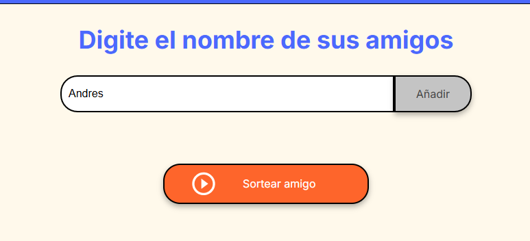
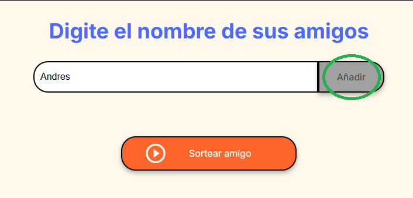
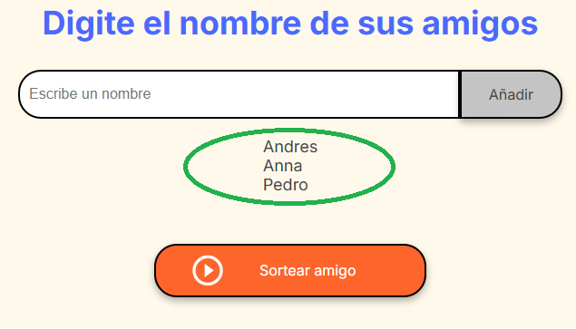
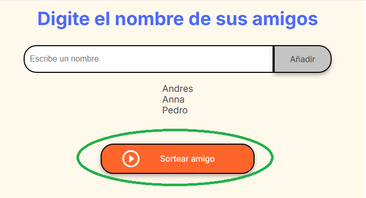
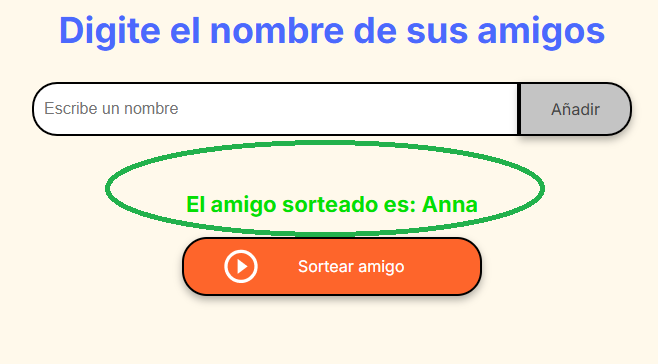

# Amigo Secreto

Este proyecto es una aplicación web simple para **sortear un amigo secreto** a partir de una lista de nombres. Desarrollado con HTML, CSS y JavaScript.

📌 Puedes probar la aplicación en vivo aquí:  
👉 [https://andresfpinzon.github.io/Challenge-Amigo-Secreto/](https://andresfpinzon.github.io/Challenge-Amigo-Secreto/)

---

## ¿Cómo funciona?

A continuación se muestra el flujo de uso de la aplicación con imágenes de referencia:

---

### 🖼️ 1. Página de inicio

Vista principal de la aplicación al ingresar.

---

### ✍️ 2. Escribir un nombre

El usuario escribe el nombre de un amigo en el campo de entrada.

---

### ➕ 3. Presionar el botón "Añadir"

Haz clic en el botón **"Añadir"** para agregar el nombre a la lista de participantes.

---

### 👥 4. Lista de amigos

Los nombres añadidos se muestran en una lista.

---

### ✅ 5. Activar el botón "Sortear amigo"

Cuando tenga al menos dos nombres en la lista, haz clic en el botón **"Sortear amigo"**.

---

### 🎉 6. Ver el amigo sorteado

Al hacer clic en **"Sortear amigo"**, se muestra el nombre seleccionado al azar.

---

## 🧠 Lógica del Proyecto

La lógica está implementada en el archivo `app.js`:

- Se almacena cada nombre ingresado en un arreglo `amigos[]`.
- La función `mostrarAmigos()` actualiza la lista en pantalla.
- La función `sortearAmigo()` elige un nombre aleatorio del arreglo y lo muestra como resultado del sorteo.

---

## ✨ Objetivo del Proyecto

El objetivo principal de este proyecto es **practicar lógica de programación** y manipulación del DOM con JavaScript, mediante una interfaz sencilla e interactiva.

---

## 🧑‍💻 Autor

Andrés F. Pinzón  
[GitHub - @andresfpinzon](https://github.com/andresfpinzon)

---
